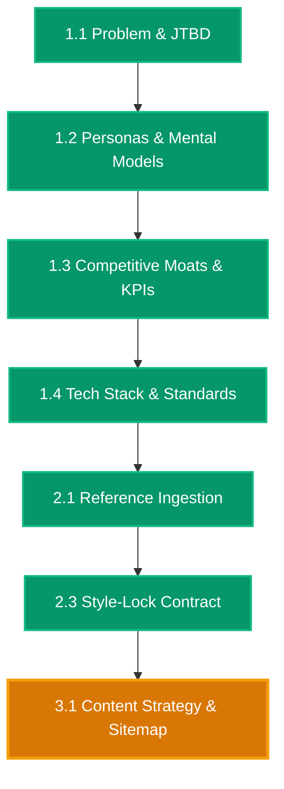

# [RESUME ANCHOR] vidya-dham-academy

> **Project Root**: `projects/Websites/vidya-dham-academy`  
> **Last Synchronized**: `2026-08-26 15:10 UTC`  
> **Active Stage**: Stage 3 (Information Architecture, Content Strategy & User Flows)  
> **Active Sub-Phase**: Phase 3.1 (Content Strategy, Scrollytelling Narrative & Sitemaps)  
> **Active Chat Session**: Chat 07  
> **Status**: `[READY FOR PHASE 3.1]`  

---

## One-Line Prompt for New Chat Session

Whenever you open a fresh chat in your IDE, simply paste:

```markdown
Resume project at projects/Websites/vidya-dham-academy. Read RESUME.md, run vibesec pre-flight, and execute Phase 3.1.
```

---

## Active Phase Summary & Invariants

- **Active Sub-Phase**: `Phase 3.1 -- Content Strategy, Scrollytelling Narrative & Sitemaps`
- **Mandatory Pre-flight**: Run [`vibesec`](file:///d:/Design-OS/.agents/skills/vibesec/SKILL.md) security check.
- **Zero-Emoji Mandate**: Absolutely zero emojis across chat, code, and documentation. Use `[PASS]`, `[FAIL]`, `[ACTIVE]`.
- **Target Artifact**: `docs/sitemap.md` (Information architecture & scrollytelling taxonomy)
- **Mandatory Skills**: [`content-strategy`](file:///d:/Design-OS/.agents/skills/content-strategy/SKILL.md), [`information-architecture`](file:///d:/Design-OS/.agents/skills/information-architecture/SKILL.md), [`navigation-patterns`](file:///d:/Design-OS/.agents/skills/navigation-patterns/SKILL.md), [`vibesec`](file:///d:/Design-OS/.agents/skills/vibesec/SKILL.md)
- **Allowed Write Paths**:
  - `docs/sitemap.md`
  - `specs/phase-3.1-spec.md`
  - `context/6-progress-tracker.md`
  - `RESUME.md`
  - `NEXT_CHAT_PROMPT.md`
- **Forbidden Write Paths**: `[src/**/*, index.html, context/2-design-tokens.json, context/3-ui-manifest.md]`

---

## Live Architecture Map Snapshot


*(For complete 24-phase map, see [`docs/DESIGN_MAP.mermaid`](file:///d:/Design-OS/projects/Websites/vidya-dham-academy/docs/DESIGN_MAP.mermaid))*
