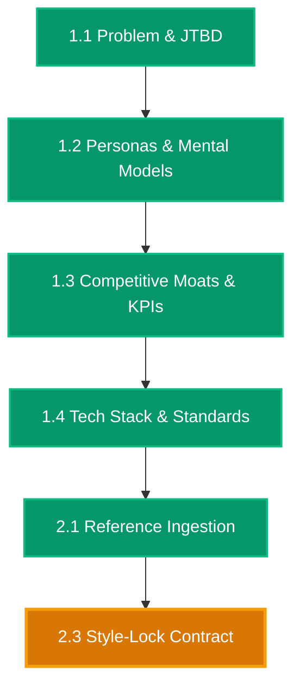

# [RESUME ANCHOR] vidya-dham-academy

> **Project Root**: `projects/Websites/vidya-dham-academy`  
> **Last Synchronized**: `2026-08-26 13:38 UTC`  
> **Active Stage**: Stage 2 (Multi-Modal Reference & Mood Lock)  
> **Active Sub-Phase**: Phase 2.3 (Socratic Style-Lock Contract & Anti-Slop Seal)  
> **Active Chat Session**: Chat 06  
> **Status**: `[READY FOR PHASE 2.3]`  

---

## One-Line Prompt for New Chat Session

Whenever you open a fresh chat in your IDE, simply paste:

```markdown
Resume project at projects/Websites/vidya-dham-academy. Read RESUME.md, run vibesec pre-flight, and execute Phase 2.3.
```

---

## Active Phase Summary & Invariants

- **Active Sub-Phase**: `Phase 2.3 -- Socratic Style-Lock Contract & Anti-Slop Seal`
- **Mandatory Pre-flight**: Run [`vibesec`](file:///d:/Design-OS/.agents/skills/vibesec/SKILL.md) security check.
- **Zero-Emoji Mandate**: Absolutely zero emojis across chat, code, and documentation. Use `[PASS]`, `[FAIL]`, `[ACTIVE]`.
- **Target Artifact**: `.tastemaker/style-lock.md` (Aesthetic contract & anti-slop rules)
- **Mandatory Skills**: [`tastemaker`](file:///d:/Design-OS/.agents/skills/tastemaker/SKILL.md), [`vibesec`](file:///d:/Design-OS/.agents/skills/vibesec/SKILL.md), `editorial-tech`
- **Allowed Write Paths**:
  - `.tastemaker/style-lock.md`
  - `.tastemaker/log.json`
  - `specs/phase-2.3-spec.md`
  - `context/6-progress-tracker.md`
  - `RESUME.md`
  - `NEXT_CHAT_PROMPT.md`
- **Forbidden Write Paths**: `[src/**/*, index.html, context/2-design-tokens.json, context/3-ui-manifest.md]`

---

## Live Architecture Map Snapshot


*(For complete 24-phase map, see [`docs/DESIGN_MAP.mermaid`](file:///d:/Design-OS/projects/Websites/vidya-dham-academy/docs/DESIGN_MAP.mermaid))*
