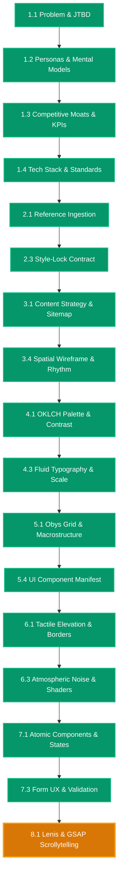

# [RESUME ANCHOR] vidya-dham-academy

> **Project Root**: `projects/Websites/vidya-dham-academy`  
> **Last Synchronized**: `2026-08-27 04:50 UTC`  
> **Active Stage**: Stage 8 (Motion Choreography, Kinetic Physics & WebGL FX)  
> **Active Sub-Phase**: Phase 8.1 (Lenis Smooth Scroll & GSAP ScrollTrigger Scrollytelling)  
> **Active Chat Session**: Chat 17  
> **Status**: `[READY FOR PHASE 8.1]`  

---

## One-Line Prompt for New Chat Session

Whenever you open a fresh chat in your IDE, simply paste:

```markdown
Resume project at projects/Websites/vidya-dham-academy. Read RESUME.md, run vibesec pre-flight, and execute Phase 8.1.
```

---

## Active Phase Summary & Invariants

- **Active Sub-Phase**: `Phase 8.1 -- Lenis Smooth Scroll & GSAP ScrollTrigger Scrollytelling`
- **Mandatory Pre-flight**: Run [`vibesec`](file:///d:/Design-OS/.agents/skills/vibesec/SKILL.md) security check.
- **Zero-Emoji Mandate**: Absolutely zero emojis across chat, code, and documentation. Use `[PASS]`, `[FAIL]`, `[ACTIVE]`.
- **Target Artifact**: Lenis smooth scroll & GSAP ScrollTrigger timelines (`context/4-motion-choreography.md`, `specs/phase-8.1-spec.md`)
- **Mandatory Skills**: [`cinematic-gsap-lenis-motion-system`](file:///d:/Design-OS/.agents/skills/cinematic-gsap-lenis-motion-system/SKILL.md), [`build-awwwards-quality-sites`](file:///d:/Design-OS/.agents/skills/build-awwwards-quality-sites/SKILL.md), [`vibesec`](file:///d:/Design-OS/.agents/skills/vibesec/SKILL.md)
- **Allowed Write Paths**:
  - `src/motion/**/*`
  - `context/4-motion-choreography.md`
  - `specs/phase-8.1-spec.md`
  - `context/6-progress-tracker.md`
  - `RESUME.md`
  - `NEXT_CHAT_PROMPT.md`
- **Forbidden Write Paths**: `[src/components/canvas/**/*, context/7-seo-and-a11y.md]`

---

## Live Architecture Map Snapshot


*(For complete 24-phase map, see [`docs/DESIGN_MAP.mermaid`](file:///d:/Design-OS/projects/Websites/vidya-dham-academy/docs/DESIGN_MAP.mermaid))*
