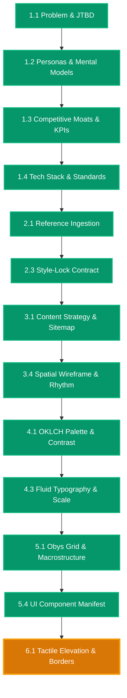

# [RESUME ANCHOR] vidya-dham-academy

> **Project Root**: `projects/Websites/vidya-dham-academy`  
> **Last Synchronized**: `2026-08-27 04:10 UTC`  
> **Active Stage**: Stage 6 (Surface Aesthetics, Materiality & Atmospheric Shaders)  
> **Active Sub-Phase**: Phase 6.1 (Tactile Surface Elevation & Hairline Border Engineering)  
> **Active Chat Session**: Chat 13  
> **Status**: `[READY FOR PHASE 6.1]`  

---

## One-Line Prompt for New Chat Session

Whenever you open a fresh chat in your IDE, simply paste:

```markdown
Resume project at projects/Websites/vidya-dham-academy. Read RESUME.md, run vibesec pre-flight, and execute Phase 6.1.
```

---

## Active Phase Summary & Invariants

- **Active Sub-Phase**: `Phase 6.1 -- Tactile Surface Elevation & Hairline Border Engineering`
- **Mandatory Pre-flight**: Run [`vibesec`](file:///d:/Design-OS/.agents/skills/vibesec/SKILL.md) security check.
- **Zero-Emoji Mandate**: Absolutely zero emojis across chat, code, and documentation. Use `[PASS]`, `[FAIL]`, `[ACTIVE]`.
- **Target Artifact**: Surface CSS module & elevation tokens (`specs/phase-6.1-spec.md`)
- **Mandatory Skills**: [`beautiful-shadows`](file:///d:/Design-OS/.agents/skills/beautiful-shadows/SKILL.md), [`css-border-gradient`](file:///d:/Design-OS/.agents/skills/css-border-gradient/SKILL.md), [`liquid-metal-border`](file:///d:/Design-OS/.agents/skills/liquid-metal-border/SKILL.md), [`vibesec`](file:///d:/Design-OS/.agents/skills/vibesec/SKILL.md)
- **Allowed Write Paths**:
  - `src/styles/surfaces.css` or `src/styles/**/*`
  - `specs/phase-6.1-spec.md`
  - `context/6-progress-tracker.md`
  - `RESUME.md`
  - `NEXT_CHAT_PROMPT.md`
- **Forbidden Write Paths**: `[src/components/**/*, context/4-motion-choreography.md, context/7-seo-and-a11y.md]`

---

## Live Architecture Map Snapshot


*(For complete 24-phase map, see [`docs/DESIGN_MAP.mermaid`](file:///d:/Design-OS/projects/Websites/vidya-dham-academy/docs/DESIGN_MAP.mermaid))*
