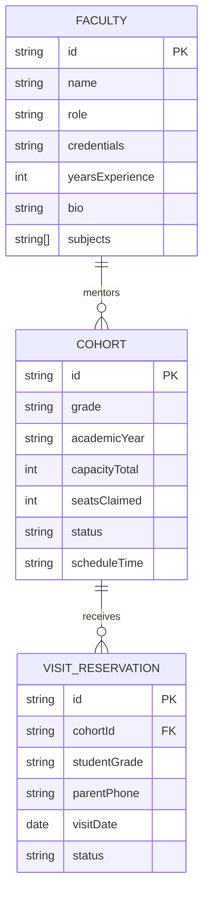

# Information Architecture, Sitemap & Content Strategy

> **Project**: `vidya-dham-academy`  
> **Workspace Path**: `projects/Websites/vidya-dham-academy`  
> **Wave**: `Wave 3: Architecture & Spatial Wireframing`  
> **Active Phase**: `Phase 3.1`  
> **Aesthetic Mode**: `editorial-tech`  
> **Status**: `[VERIFIED ARCHITECTURAL SPECIFICATION]`  

---

## 1. Executive Summary & Golden Path Journey

The information architecture of Vidya Dham Academy is structured to serve two primary decision-makers:
1. **Rajesh Sharma (The Accountable Parent)**: Needs instant verification of physical safety, batch size limits ($\le 25$), faculty credentials, and transparent fee schedules without high-pressure marketing tactics.
2. **Ananya Sharma (The Concept-Hungry Student)**: Seeks visual comprehension of difficult STEM topics, an escape from chaotic mega-coaching auditoriums, and reassurance of direct access to teachers.

### The Golden Path Flow (Mobile & Desktop)
```
[Entry Point: Direct / WhatsApp Referral]
   │
   ▼
[Stage 1: Asymmetric Hero Hook] ──► Live Cohort Counter (19/25 Seats Claimed)
   │
   ▼
[Stage 2: Institutional Credibility Bar] ──► Max 25 Learners | Zero Backbenchers | Master Faculty
   │
   ▼
[Stage 3: Interactive Smart Board Bento] ──► Interactive STEM Derivation Preview (Browser Canvas)
   │
   ▼
[Stage 4: Pinned Comparison Track] ──► Commercial Factory (100 students) vs. Vidya Dham (25 students)
   │
   ▼
[Stage 5: Conversion Anchor] ──► Saturday Open Classroom Visit (Lightweight 2-Field Bottom Sheet)
   │
   ▼
[Stage 6: Monastic Semantic Footer] ──► Physical Campus Address, Safety Accreditations, Direct WhatsApp
```

---

## 2. Navigation Architecture & Chrome Specifications

### 2.1 Persistent Desktop Header
- **Layout**: Fixed top bar ($H = 64\text{px}$), $W = 100\%$, contained within max-w-7xl ($1440\text{px}$).
- **Materiality**: Background `rgba(9, 13, 22, 0.85)` with `backdrop-filter: blur(16px)` and a `0.5px` bottom hairline border in `rgba(255, 255, 255, 0.12)`.
- **Components (Left to Right)**:
  1. *Brand Identity*: Geometric Academic Seal (amber/white) + Geist wordmark `VIDYA DHAM ACADEMY` (`font-mono text-xs tracking-widest text-slate-200`).
  2. *Live Availability Pill*: Micro status pill with blinking emerald indicator dot (`[ACTIVE] Cohort 2026-27: 19/25 Claimed`).
  3. *Primary Action*: High-contrast amber button `[Reserve Classroom Visit]` ($H = 40\text{px}$, text `#090d16`, bg `#f59e0b`).
  4. *Editorial Drawer Trigger*: Minimalist 2-line icon button ($44\text{px} \times 44\text{px}$) that opens the full-screen typographic drawer.

### 2.2 Full-Screen Typographic Editorial Drawer
- **Trigger**: Click/Tap on the header menu icon or pressing `M` key on desktop.
- **Behavior**: Fast 200ms ease-out backdrop expansion with zero body scroll (`overflow: hidden`).
- **Visual Presentation**:
  - Left Column (Desktop 60%): Massive display typography links (`clamp(2rem, 4vw, 3.5rem)`) with hovered amber underline rules.
    - `01 / Overview & Vision` (`/` or `#hero`)
    - `02 / Smart Board Pedagogy` (`/pedagogy` or `#pedagogy`)
    - `03 / Master Mentors & Doubt Desks` (`/faculty` or `#faculty`)
    - `04 / Cohort Availability & Admissions` (`/admissions` or `#admissions`)
    - `05 / Campus Safety & Governance` (`/legal`)
  - Right Column (Desktop 40%): Operational metadata ledger.
    - Physical Address: `Vidya Dham Campus, Sector 4, Civic Center Road`.
    - Academic Help Desk: `+91 (0) 98765 43210` (Direct line, no automated IVR).
    - Class Schedule: `Monday – Saturday: 08:30 – 19:30`.
    - Safety Officer Contact & CCTV Verification badge.

### 2.3 Mobile Dual-Action Sticky Command Strip
- **Ergonomics**: Fixed at screen bottom ($H = 64\text{px} + \text{safe-area-inset-bottom}$).
- **Compliance**: Fitts's Law optimized ($D \approx 0$ from thumb rest zone).
- **Actions**:
  - *Primary Action (75% Width)*: `[Reserve Classroom Visit]` ($H = 48\text{px}$, high-contrast amber `#f59e0b`, bold text `#090d16`).
  - *Secondary Action (25% Width / $48\text{px} \times 48\text{px}$)*: `[WhatsApp Direct]` (deep charcoal slate button with WhatsApp vector icon).

---

## 3. Flagship Scrollytelling Section Inventory (`/`)

### Stage 1: Asymmetric Hero Beat
- **Heading**: "Disciplined Offline Rigor. Illuminated by Interactive Smart Boards."
- **Sub-headline**: "Small cohorts strictly capped at 25 students. Daily direct mentorship from master teachers. Zero commercial backbenchers."
- **Visual Asset**: Split layout featuring a live interactive preview of the Smart Board optics derivation and real-time seat availability counter.
- **Micro-copy Metadata**: `ACADEMIC YEAR 2026-27 | FOUNDATION & BOARD MASTERY | GRADES 8–12`.

### Stage 2: Institutional Credibility Bar
- **Rhythm**: Obys 140px vertical spacing separation with 0.5px hairline divider.
- **Pillars Displayed**:
  1. *25-Student Ceiling*: Mathematical guarantee that every student sits in the first 4 rows.
  2. *Master Faculty Only*: Core subjects taught exclusively by founders; zero rotating proxy teachers.
  3. *Daily Doubt Desk*: Dedicated 60-minute post-class personal solving desk for every student.
  4. *Transparent Governance*: Clear fee schedule published upfront; no hidden commercial fees.

### Stage 3: Smart Board Pedagogy Bento Grid
- **Module 3.1: Interactive Canvas Stage**: High-framerate interactive STEM simulation (Ray Optics / Vector Mechanics) allowing prospective students to drag refraction indices and experience visual clarity directly.
- **Module 3.2: Dual-Track Problem Solving**: Visual Smart Board derivation on screen synchronized with disciplined, handwritten step-by-step notebook methods.
- **Module 3.3: Weekly Concept Diagnostic**: Low-stakes 20-minute Friday micro-tests measuring concept velocity rather than memorization anxiety.

### Stage 4: Pinned Comparison Track (Mass Factory vs. Intimate Rigor)
- **Mechanic**: Desktop scroll-pinned side-by-side comparison ledger; mobile swipeable 2-card toggle.
- **Dimensions of Comparison**:
  | Feature | Commercial Coaching Mega-Factories | Vidya Dham Academy |
  | :--- | :--- | :--- |
  | **Batch Size** | 70 to 120+ students packed into auditoriums | Strictly capped at 25 students |
  | **Faculty Model** | Rotating junior tutors and proxy lecturers | Permanent founding master teachers |
  | **Doubt Resolution** | Queued ticketing apps or crowded weekly counters | Daily 1-on-1 desk before leaving campus |
  | **Technology** | Passive video streams or basic chalkboards | Interactive 4K smart board visual modeling |
  | **Accountability** | Impersonal student numbers; parent opacity | Weekly direct parent-teacher phone updates |

### Stage 5: Conversion Anchor (Saturday Open Classroom Visit)
- **Context**: Invites parents and students to attend an actual live 45-minute offline demo class on Saturday morning.
- **Form UX**: Minimalist 2-field reservation bottom-sheet / modal:
  1. Student Grade Selection (Chips: Grade 8, 9, 10, 11, 12).
  2. Parent Phone Number (10-digit input with instant validation).
- **Guarantees**: Zero automated telemarketing calls; reservation details sent instantly via WhatsApp.

### Stage 6: Monastic Semantic Footer
- **Institutional Accreditation**: Registered offline academy charter and state education board compliance.
- **Campus Details**: Physical address with Google Maps link, visiting hours, and designated student drop-off zones.
- **Compliance & Safety**: Fire safety certificate, 24/7 CCTV surveillance protocol, and student emergency protocols.
- **Navigation Links**: Deep links to `/pedagogy`, `/faculty`, `/admissions`, and `/legal`.

---

## 4. Deep-Dive Page Taxonomies

### 4.1 `/pedagogy` — Academic Pedagogy & Curriculum Architecture
- **Purpose**: Exhaustive documentation of the visual derivation system and curriculum milestones for academic scrutiny.
- **Section 1: The Visual STEM Engine**: Detailed breakdown of why smart board visual models improve spatial reasoning in Physics and Mathematics.
- **Section 2: Curriculum Roadmaps**: Term-by-term syllabus breakdown for Grades 8, 9, 10 (Foundation) and Grades 11, 12 (Board & Entrance).
- **Section 3: The 3-Tier Notebook System**: Lecture notes, daily practice problems (DPP), and error-analysis journal.

### 4.2 `/faculty` — Master Mentors & Academic Governance
- **Purpose**: Establish deep trust with parents by detailing faculty credentials, academic philosophy, and teaching hours.
- **Section 1: Founding Faculty Profiles**:
  - *Vikram Patel* — Head of Physics & Academic Director (M.Sc. Physics, 14+ years teaching experience).
  - *Dr. Sunita Rao* — Head of Chemistry & Foundation Sciences (Ph.D. Organic Chemistry, author of 6 textbook guides).
  - *Anand Deshmukh* — Head of Mathematics & Applied Geometry (B.Tech IIT Bombay, 11+ years olympiad coaching).
- **Section 2: The Faculty Code**: 100% attendance by primary faculty, zero unannounced substitutions, and personal mentor assignment for each student.

### 4.3 `/admissions` — Cohort Availability & Open Visit Booking
- **Purpose**: Transparent admission guidelines, fee structures, and reservation scheduling.
- **Section 1: Real-Time Cohort Status Ledger**:
  - Grade 9 Foundation: 21 / 25 Seats Claimed (`4 Available`)
  - Grade 10 Board Accelerator: 24 / 25 Seats Claimed (`1 Available`)
  - Grade 11 Physics & Math Intensive: 18 / 25 Seats Claimed (`7 Available`)
  - Grade 12 Advanced Mastery: 22 / 25 Seats Claimed (`3 Available`)
- **Section 2: Fee Transparency**: Comprehensive quarterly fee schedules with zero admission fees or hidden material surcharges.
- **Section 3: Assessment Protocol**: Diagnostic conceptual test structure used solely for cohort pacing, not student rejection.

---

## 5. Content Model & Data Entities



---

## 6. Micro-Copy Voice & Tone Guidelines

### Tone Dimensions
- **Authoritative without being Arrogant**: We speak as serious educators who respect the intelligence of both parents and students.
- **Transparent without being Apologetic**: We state our fees, batch limits, and policies clearly and directly.
- **Restrained without being Cold**: We show deep care for student welfare through disciplined actions, not emotive advertising slogans.

### Do's and Don'ts Matrix
| Context | Prohibited (Commercial Slop) | Mandated (Editorial Tech Rigor) |
| :--- | :--- | :--- |
| **Cohort Availability** | "Hurry! Only 2 seats left! Book now before you miss out!" | "Cohort 2026-27: 19 of 25 seats claimed. Cohort closes permanently upon capacity." |
| **Pedagogy Claims** | "India's #1 revolutionary AI-powered smart classes!" | "Interactive 4K digital boards transform abstract derivations into clear visual geometry." |
| **Visit Invitation** | "Claim your 100% FREE scholarship test today!" | "Reserve an offline classroom observation. Sit with our faculty before enrolling." |
| **Faculty Bio** | "Star faculty with viral teaching shortcuts!" | "14 years of disciplined offline STEM instruction. Dedicated daily doubt clearing." |
| **Form Button** | "SUBMIT NOW!" | "Reserve Saturday Classroom Visit" |

---

## 7. Quality & Verification Gates

1. **Information Architecture Heuristic Pass**: Navigation depth $\le 2$ tiers. All primary content discoverable in $\le 2$ interactions.
2. **WCAG 2.2 AA Contrast Compliance**: All navigation links, drawer typography, and button fills adhere to verified ratios ($\ge 18.57:1$ primary text, $\ge 9.05:1$ buttons).
3. **Cybersecurity / VibeSec Compliance**:
   - Zero open redirect vulnerabilities. All internal links are relative paths.
   - WhatsApp link uses validated static endpoint (`https://wa.me/...`).
   - Zero third-party tracker scripts or un-sanitized external embeds.
4. **Deterministic Gatekeeper Command**:
   ```bash
   python scripts/phase_gate.py --phase 3.1 --allowed docs/sitemap.md specs/phase-3.1-spec.md
   ```
